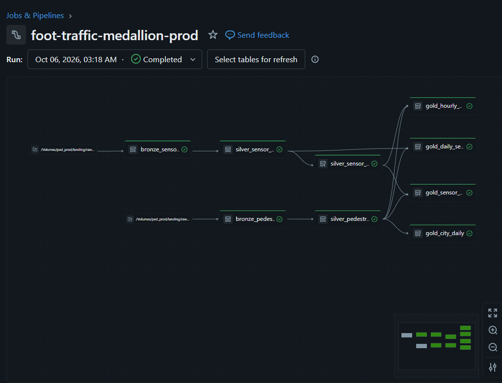
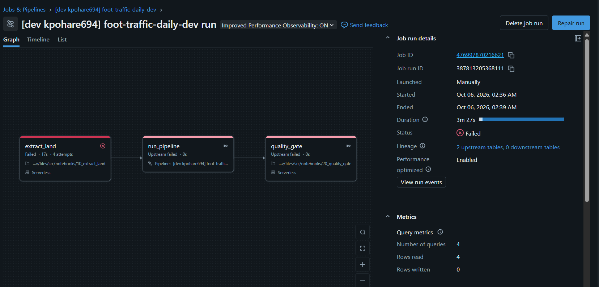
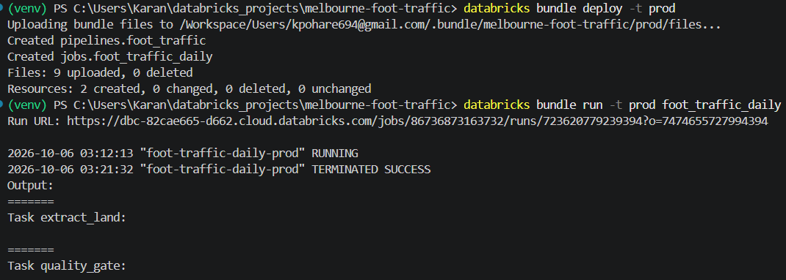
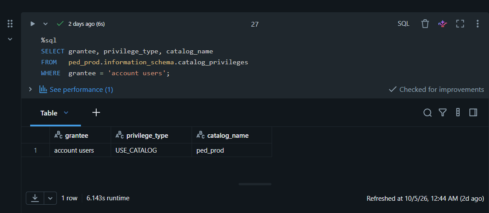
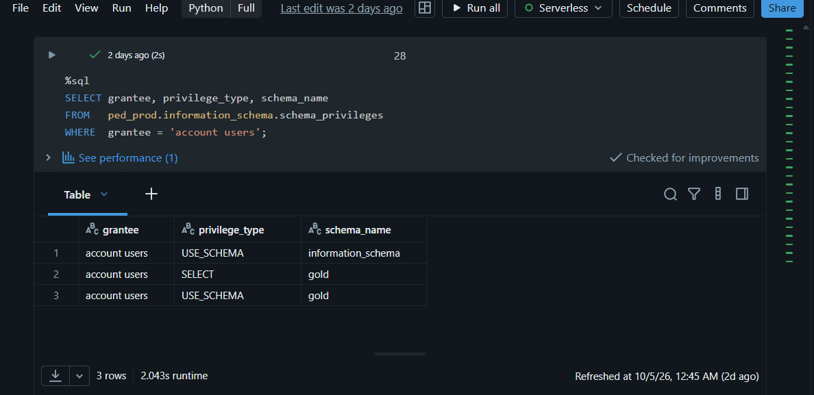
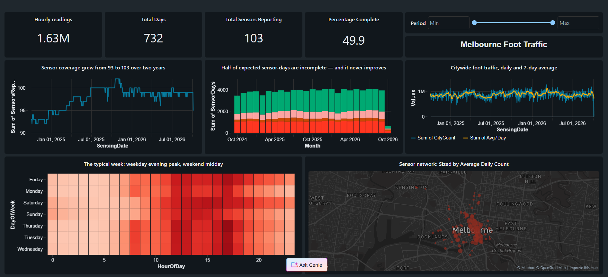
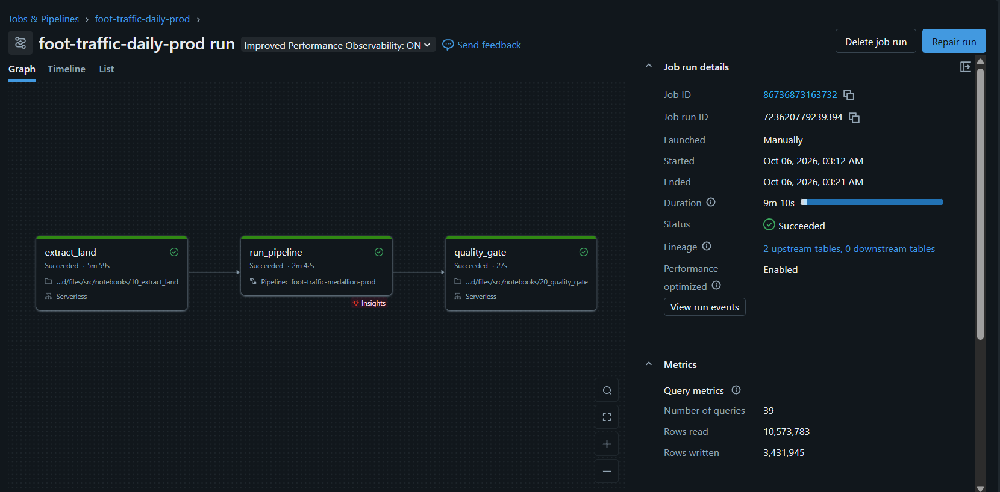

# Melbourne Foot Traffic Lakehouse

Hourly pedestrian counts for the City of Melbourne, from a public REST API to governed Gold tables on Databricks. Incremental, deduplicated, quality-gated, and deployed dev→prod from a single definition.

**1,624,373 hourly readings · 103 sensors · 730 days · 9 tables · 3-task scheduled job**

[The finding](#the-finding) · [Architecture](#architecture) · [Three bugs worth recording](#three-bugs-worth-recording) · [dev→prod](#dev--prod) · [Constraints](#constraints-and-what-id-change-with-a-budget)

---

## The finding

**The City of Melbourne's sensor registry lists 134 active pedestrian sensors. 34 of them have not produced a single reading in two years — and 3 sensors produce readings while appearing nowhere in the registry at all.**

Not "offline recently" — never, across the full window, while flagged `status = 'A'`. The integrity gap runs in both directions: 134 sensors registered active, only 100 of which have ever reported, against 103 distinct sensors actually present in the data.

It gets worse once you look at the sensors that *do* work:

| Sensor-day status | Sensors affected | Sensor-days | Share |
|---|---|---|---|
| healthy | 93 | 46,784 | **49.9%** |
| no data at all | 68 | 25,410 | 27.1% |
| incomplete (missing hours) | 95 | 15,336 | 16.4% |
| partial outage (>4 hours lost) | 97 | 6,212 | 6.6% |
| suspect (24 hours of zeros) | 1 | 1 | <0.1% |

**Exactly half of expected sensor-days are complete** — but that headline is two findings welded together. The 34 permanently-silent sensors contribute 24,922 sensor-days at 0% and drag a quarter of the grid to zero on their own; the sensors that *do* report are **67.9% complete**. 49.9% is the honest figure for the network as published; 67.9% is the honest figure for the hardware that works. Both are stable across all 24 months — this is the structural condition of the network, not a bad patch. Note the `sensors affected` column: 95 of the 97 reporting sensors drop hours regularly. A sensor reporting 23 of 24 hours looks perfectly healthy in any daily total, and nobody would ever notice.

None of this is visible from the published data. It only appears when you build the grid of readings you *should* have received and reconcile actuals against it. Every analysis of this dataset that trusts `status = 'A'`, or that treats absence as zero, is quietly wrong.

---

## Architecture



```
data.melbourne.vic.gov.au          │  Databricks (serverless)
  Opendatasoft Explore API v2.1    │
            │                      │
            │ /exports/json        │   ┌──────────────────────────────────┐
            │ ?where=<month>       │   │ UC VOLUME  ped_prod.landing.raw  │
            ▼                      │   │   pedestrian_hourly/             │
  ┌──────────────────────┐  writes │   │     ingest_month=YYYY-MM/*.jsonl │
  │ 10_extract_land      ├─────────┼──▶│   sensor_locations/              │
  │ · watermark ← Silver │         │   │     ingest_date=YYYY-MM-DD/      │
  │ · month windows      │         │   └───────────────┬──────────────────┘
  │ · 429/5xx backoff    │         │                   │ Auto Loader
  │ · array → NDJSON     │         │                   ▼
  └──────────────────────┘         │   ┌──────────────────────────────────┐
                                   │   │ LAKEFLOW DECLARATIVE PIPELINE    │
                                   │   │                                  │
                                   │   │  BRONZE  (streaming tables)      │
                                   │   │   bronze_pedestrian_hourly       │
                                   │   │   bronze_sensor_locations        │
                                   │   │            ▼                     │
                                   │   │  SILVER                          │
                                   │   │   silver_pedestrian_hourly       │
                                   │   │     7 expectations, dedup        │
                                   │   │   silver_sensor_scd  (SCD2)      │
                                   │   │   silver_sensor_current          │
                                   │   │            ▼                     │
                                   │   │  GOLD  (materialized views)      │
                                   │   │   gold_daily_sensor_counts       │
                                   │   │   gold_hourly_profile            │
                                   │   │   gold_sensor_health             │
                                   │   │   gold_city_daily                │
                                   │   └───────────────┬──────────────────┘
                                   │                   ▼
                                   │     2X-Small SQL warehouse → AI/BI dashboard
                                   │
   JOB  foot-traffic-daily · 06:15 Australia/Melbourne · max 1 concurrent run
   extract_land (3 retries) → run_pipeline (2 retries) → quality_gate (0 retries)
```

---

## Four engineering decisions worth explaining

### 1. Windowed extraction, because pagination is structurally impossible

The Opendatasoft `/records` endpoint caps `offset + limit` at **10,000**. This dataset holds **1.62 million rows**. Pagination cannot reach past the first 0.6% of it — not slowly, at all.

So the extractor windows `/exports/json` by month and lets the server stream each window:

```python
where = (f"sensing_date >= date'{win_start:%Y-%m-%d}' "
         f"AND sensing_date <  date'{win_end:%Y-%m-%d}'")
rows = fetch(f"{BASE}/exports/json", {"where": where, "order_by": "sensing_date"})
```

**~25 HTTP calls for the full two years** instead of an impossible 16,000+. Even a single month is 68,000 rows — nearly 7× the paging ceiling.

The extractor retries `429` and `5xx` with `Retry-After` when the server sends it and exponential backoff with jitter when it doesn't, and never retries other `4xx` — a malformed ODSQL filter fails identically every time.

### 2. The source keeps 24 months. This pipeline keeps everything.

The API serves a **rolling two-year window**; the publisher drops the oldest day as each new one lands. That makes Bronze the only long-term archive, which is an unusually concrete justification for a raw layer — most pipelines copy a source that would still be there tomorrow.

It also makes `VACUUM` genuinely consequential rather than academic: once the source rolls past a date, Delta history is the only copy.

### 3. The watermark lives in the lakehouse, and the overlap is deliberate

`10_extract_land` reads `max(sensing_date)` from Silver, then re-fetches from **three days before that**. No state file to lose, and the extract is safe to re-run.

The overlap looks wasteful and isn't. The publisher backfills late corrections, so an exact-watermark resume would miss them permanently. The overlap is free because Silver deduplicates:

```python
.withWatermark("sensing_ts_local", "7 days")
.dropDuplicatesWithinWatermark(["location_id", "sensing_ts_local"])
```

### 4. Outages are data, not silence

`gold_sensor_health` cross-joins active sensors against every date after their installation, then left-joins actuals. That is what separates "zero pedestrians" from "sensor offline."

It also computes the expected hours in each day **from the timezone database** rather than hardcoding 24:

```sql
CAST((unix_timestamp(to_utc_timestamp(CAST(sensing_date + INTERVAL 1 DAY AS TIMESTAMP), 'Australia/Melbourne'))
    - unix_timestamp(to_utc_timestamp(CAST(sensing_date AS TIMESTAMP), 'Australia/Melbourne'))
     ) / 3600 AS INT) AS expected_hours
```

23 hours when daylight saving starts, 25 when it ends, 24 the rest of the time — correct in any year, with no maintained list of changeover dates. Verified: exactly four DST days in the two-year window (2024-10-06, 2025-04-06, 2025-10-05, 2026-04-05), alternating 23/25.

---

## Data quality

Seven expectations across three severities, each chosen deliberately.

| Expectation | Severity | Why that severity |
|---|---|---|
| `location_present` | drop | A count with no sensor can't join, map or group. Nothing to do with it. |
| `date_present` | drop | Poisons the derived timestamp too. |
| `hour_in_range` | drop | `make_timestamp` would produce garbage. |
| `count_not_negative` | drop | `>= 0`, not `> 0` — **zero is a legitimate reading** at 4am, and dropping zeros biases every average upward. |
| `no_api_drift` | **warn** | Dropping rescued rows would destroy the only evidence the API changed. Keep the row *and* the alert. |
| `directions_reconcile` | **warn** | Directions don't always sum to the total — real sensor behaviour under crowding, not corrupt data. Quantify it, don't delete it. |
| `no_future_dates` | **fail** | Can't be bad source data. Only means my own date derivation broke. Stop immediately. |

The two warnings use explicit NULL guards, because SQL is three-valued and a NULL evaluation is not `TRUE` — without them, every single-direction sensor would be flagged.

`20_quality_gate` then reads the pipeline's own event log plus the data itself, and **fails the job** on staleness over 3 days, any rescued-data rows in the last 2 days, or any expectation dropping more than 5% of rows. A pipeline that silently discards 40% of its input and reports success is worse than one that crashes.

---

## Three bugs worth recording

**A green run that lost 96% of the data.** After backfilling 24 months, the pipeline ran clean — no errors, no failed expectations, nothing in the event log — and Silver still held only 33 days. Auto Loader's incremental directory listing assumes files arrive in lexicographically increasing order; the backfill landed `2024-10` through `2026-08` *after* `2026-09`, so it looked straight past them. Fixed with `cloudFiles.useIncrementalListing = false`. Caught only by `SELECT min(sensing_date), max(sensing_date)`.

*At scale the better fix is `cloudFiles.backfillInterval` — keep incremental listing for speed, sweep periodically for correctness.*

**A health classifier that invented a cause.** The first version labelled any 23-hour day a daylight-saving boundary. There is no DST transition in September; those were sensors that missed an hour. 289 sensor-days misclassified. Replaced the hardcoded 24 with the timezone-derived day length, and split `is_dst_day` out as its own column — DST describes the *calendar*, not the *sensor*.

**A cold-start dependency, found by deploying.** The extractor read its watermark from Silver without handling Silver not existing. Invisible for two days; failed instantly the first time the bundle deployed into an empty catalog — which is exactly what a production deployment is. Now wrapped in a try/except that falls back to the start of the source window.



*Four attempts, all failing identically in 17 seconds. Retries fix transient
failures; this one was deterministic, so retrying only burned time. That is why
the quality gate is configured with zero retries.*

---

## dev → prod

Two Unity Catalog catalogs, `ped_dev` and `ped_prod`, identical in shape. One bundle definition targets both:

```bash
databricks bundle validate -t dev
databricks bundle deploy   -t dev
databricks bundle deploy   -t prod    # that's the whole promotion
```



No notebook edited, no schedule re-entered, no catalog name hard-coded anywhere. The pipeline code reads its catalog from `spark.conf.get("project.catalog")`, the bundle injects it per target, and the job references the pipeline by bundle identifier rather than by ID.

`mode: production` refused to deploy until the deployment path and run-as identity were stated explicitly rather than inferred from whoever ran the command. In a team that is the difference between one production deployment and one per developer.

Access control, verified from the catalog's own metadata rather than a settings page:

```sql
GRANT USE CATALOG ON CATALOG ped_prod      TO `account users`;
GRANT USE SCHEMA  ON SCHEMA  ped_prod.gold TO `account users`;
GRANT SELECT      ON SCHEMA  ped_prod.gold TO `account users`;
```




Three grants, not one. Bronze, Silver, landing and ops are deliberately not granted — without `USE SCHEMA`, a reader cannot see they exist. Exclusion comes from not granting, not from `DENY`.

Note the `information_schema` row, which was never granted: Unity Catalog adds it automatically to anyone holding `USE CATALOG`, so principals can discover what exists without being able to read it. **Metadata visibility and data access are separate privileges.**

---

## Repository

```
melbourne-foot-traffic/
├── databricks.yml                      bundle: targets, variables
├── resources/
│   ├── pipeline.yml                    the medallion pipeline
│   └── job.yml                         3 tasks, schedule, retries, alerts
├── src/
│   ├── transformations/                pipeline source (read by the pipeline only)
│   │   ├── 01_bronze.py                Auto Loader → 2 streaming tables
│   │   ├── 02_silver.py                expectations, dedup, SCD2
│   │   └── 03_gold.sql                 4 materialized views
│   └── notebooks/                       job tasks
│       ├── 10_extract_land.py          REST → NDJSON in a UC volume
│       └── 20_quality_gate.py          fails the run on bad data
├── sql/
│   ├── 00_setup_catalogs.sql
│   └── 01_grants.sql
└── docs/
    ├── pipeline-graph.png              prod pipeline lineage, 9 nodes
    ├── dashboard.png                   the AI/BI board
    ├── grants-catalog.png              USE CATALOG, from information_schema
    ├── grants-schema.png               USE SCHEMA + SELECT on gold only
    ├── bundle-deploy-prod.png          one command, 2 resources created
    ├── job-run-success.png             10.5M rows read, 9m 10s
    └── job-run-coldstart-failure.png   the bug the bundle found
```

---

## Dashboard



Five tiles on a `2X-Small` SQL warehouse: headline counters, citywide daily traffic with its 7-day average, sensor coverage over time, sensor-health composition by month, a weekday × hour heatmap, and a map sized by average daily count.

The coverage tile matters for reading the trend line: **active sensors grew from 93 to 103 over the two years**, so part of any rise in raw citywide totals is more sensors rather than more people. `gold_city_daily` therefore carries `sensors_reporting` and a `count_per_sensor` normalisation alongside the raw figure.

---

## It runs itself



Daily at 06:15 Australia/Melbourne. **10,573,783 rows read, 3,431,945 written, 9m 10s**, three tasks, no intervention.

And it refuses to pass bad data. Forcing the staleness threshold to zero makes `quality_gate` fail while `extract_land` and `run_pipeline` both stay green — they did their jobs; the gate is what caught the problem, which is the design.

---

## Constraints, and what I'd change with a budget

Built on **Databricks Free Edition**: serverless compute only, one active pipeline per type, one `2X-Small` SQL warehouse, one metastore, and a single serverless capacity slot shared between the pipeline and the warehouse.

Decisions that were constraints rather than preferences, and what I'd do otherwise:

| Here | With a paid workspace |
|---|---|
| Bronze→Silver→Gold in **one** pipeline | Separate pipelines per layer, so Bronze can run continuously while Gold refreshes hourly |
| Quality gate as a **notebook** task | A SQL task on the warehouse — the single capacity slot can't hold a pipeline and a warehouse at once |
| Grants to the built-in `account users` group | A dedicated `foot_traffic_analysts` group provisioned through SCIM. Groups cannot be created from SQL — identity lives upstream of Unity Catalog |
| Auto Loader **directory listing** | File notification mode, once file counts justify the cloud resources |
| `useIncrementalListing = false` | `backfillInterval`, keeping incremental listing's speed |
| Managed UC volume | An external location, since Free Edition allows no custom workspace storage |

**What breaks first at scale:** the Gold materialized views. The Databricks UI reports all four as *Full recompute* — window functions, `CROSS JOIN` and `percentile_approx` all block incremental refresh. Irrelevant at 1.6M rows; relevant at 100M. The fix is to incrementalise `gold_sensor_health` to compute per-day and append, and to materialise the rolling profile weekly rather than every run.

---

## Known limitations

- **Two years only.** The source's rolling window means `lag(..., 364)` year-on-year comparison is available for the most recent year and null before it. This will self-correct as the lakehouse accumulates history the API no longer serves.
- **Counts are passages, not people.** One person walking to lunch and back is two counts. This dataset cannot answer "how many people visited the CBD."
- **`suspect_all_zero` is under-tuned.** One sensor-day in 93,743 trips the rule. Either the heuristic is too strict or genuine all-zero failures are rarer than expected; it needs a closer look.
- **Non-commercial.** Free Edition's terms, and the City of Melbourne's open-data licence, both apply.

## Next

- Join daily weather (Open-Meteo archive API — free, keyless, historical) to quantify what rain costs CBD foot traffic
- Victorian public holidays, so "quiet Monday" and "Melbourne Cup Day" stop looking the same
- Register the holiday table in Lakebase Postgres as a foreign catalog, to query without copying

---

## Sources

- [Pedestrian Counting System — City of Melbourne Open Data](https://data.melbourne.vic.gov.au/explore/dataset/pedestrian-counting-system-monthly-counts-per-hour/)
- [Opendatasoft Explore API v2.1 reference](https://help.opendatasoft.com/apis/ods-explore-v2/explore_v2.1.html)
- [Databricks Free Edition limitations](https://docs.databricks.com/aws/en/getting-started/free-edition-limitations)
